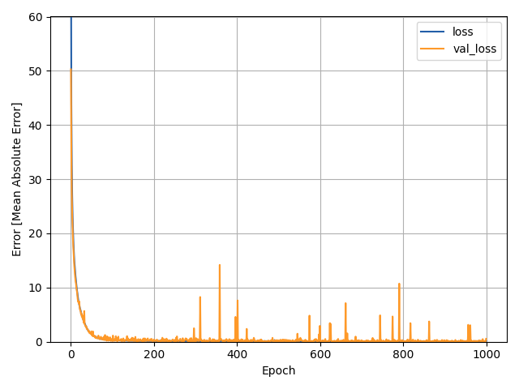

# NDPX Performance Estimator
To cite XLA-NDP, cite
``` bibtex
@ARTICLE{10079098,
  author={Park, Jueon and Sung, Hyojin},
  journal={IEEE Computer Architecture Letters}, 
  title={XLA-NDP: Efficient Scheduling and Code Generation for DL Model Training on Near-Data Processing Memory}, 
  year={2023},
  volume={},
  number={},
  pages={1-4},
  doi={10.1109/LCA.2023.3261136}}
```

To cite NDPX, cite
``` bibtex
@ARTICLE{9609620,
  author={Ham, Hyungkyu and Cho, Hyunuk and Kim, Minjae and Park, Jueon and Hong, Jeongmin and Sung, Hyojin and Park, Eunhyeok and Lim, Euicheol and Kim, Gwangsun},  
  journal={IEEE Computer Architecture Letters},   
  title={Near-Data Processing in Memory Expander for DNN Acceleration on GPUs},   
  year={2021},  
  volume={20},  
  number={2},  
  pages={171-174},  
  doi={10.1109/LCA.2021.3126450}}
```

This project is generated to estimate the NDPX's performance.

The NdpxEstimator estimates the performance of NdpxKernel based on the:
 - shape size
 - #inputs
 - #outputs
 - and, #ops.

As you see, it is just a simple regression model.

## Datasets
I manually collected all the data from the previous experiments. The experiments were held on Resnet18 and MobileNet v2.

## Model
Currently just using a bunch of dense layers stacked

## Result
The loss is as the followings:



The prediction result is as the followings:


